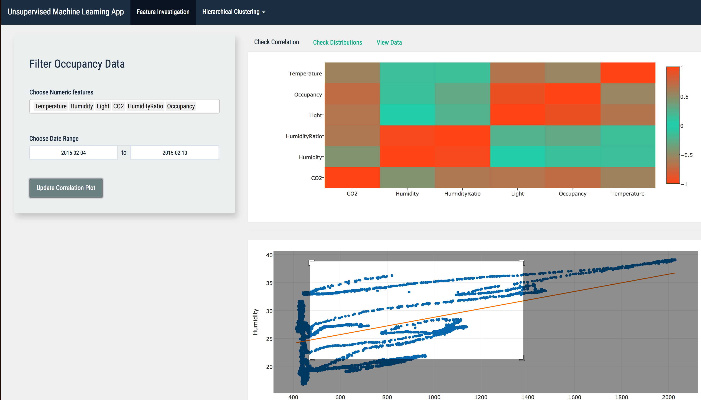

# Unsupervised-Machine-Learning-with-RShiny
_by Mustafa Waheed_

Appliction Hosted here: https://mustafawaheedapps.shinyapps.io/Unsupervised-Machine-Learning-with-RShiny/

This is an End to End clustering application implemented primarily in R and to a lesser extent javascript (for viz)

Not only do I walk you through a distance based clustering application, the app will allow for catagorization of  
these clusters and for new data of the *same format* to be uploaded and predicted against these establish and  
profiled clusters.

Please Note that you would need the following on you machine:
*R version 3.3.3*

## Please Remember Feature Engineering is not a focus in the tool.

That this is only a tool which demonstrates clustering and result profiling on any multivariate time-series data
[Occupancy_data](http://archive.ics.uci.edu/ml/datasets/Occupancy+Detection+#)
... 
 
### Please note 
that it is essential to go throught the initial clustering process in order to see the visualizations.
